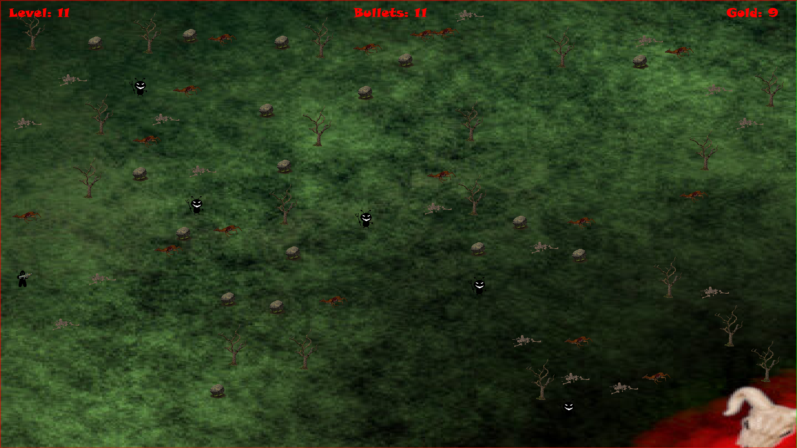
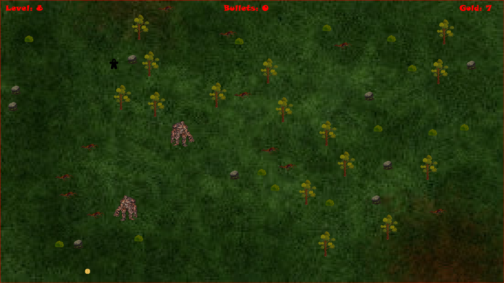
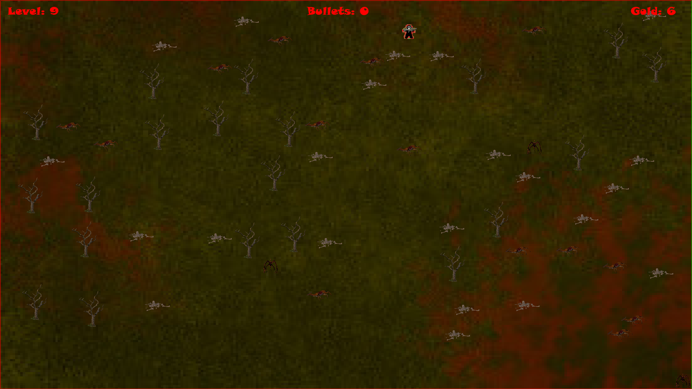

# Dark-forest-client 

# Description

Client for Dark Forest game, connected with Dark Forest server. Now you can create account,login to account,show globals scores and stats. In client settings you can change resolution and brightness. I host server in internet so now u can always use client to rivalize with other players.

You have to try survive the most number of levels. Before going to the next level you have to pick up gold in actualy level. When you pick the gold go to the right border of map. You can buy equipmend in shop, destroy obstacles and killing monsters. Press m in game to show more tips. Game have infinite number of different levels. Every 50 levels you can find boss.

## License

Application is licensed under the MIT License.

# Instalation

## Windows

## [Client instalator](https://drive.google.com/drive/folders/1VaAz0Dw-3dUOMgjF_Wv8NaGZLofEAw8w?usp=sharing)

## Manual instalation

## Copying the repository

```
git clone https://github.com/0lch4/Dark_forest_client.git
```

## Installing the liblaries

You have to use `poetry` to install liblaries:

```
pip install poetry
```

In next step enter in main project location:

```
poetry install
```

Finally, activate your environment:

```
poetry shell
```

## Font installation

Go to the 
```
client/client/game/font/Snap.ttf
``` 
Click on it and download

## Distributions based on Arch linux

You have to use `poetry` to install liblaries:

```
pipx install poetry
```

On linux pygame have problems so install it witch packet manager

```
sudo pacman -S python-pygame
```

In next step enter in main project location:

```
pipx run poetry install
```

Finally, activate your environment:

```
pipx run poetry shell
```

## Font installation

Enter in main project location:

```
sudo cp client/game/font.snap.ttf /usr/share/fonts/TTF
``` 
In the next step:

```
fc-cache -fv
```

# Usage

When all dependencies are met, enter in the main location:

```
python -m client.main
```
# Sources:
Sounds an textures i find in the internet, some of it i edited.

# Screenshots




